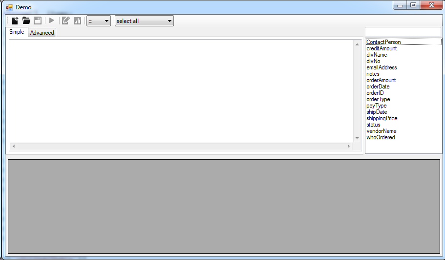

# CC.Common.UserQuery
Winform UserControl for custom queries

 - add the project to your solution, or build and reference the assembly
 - in your win form app, you should have a new control in your toolbox - UserQueryUI
 - drop one on your form
 - Set the properties
   - Application Name - When data is exported this is prepended to the file name by default
   - Database View Name - Set this to a view to pull fields from (you need to create the view)
   - Path (Simple) - Set this to the path to read/write simple queries
   - Path (Advanced) - Set this to the path to read/write advanced queries
   - Database Config - Create a user with select only permissions
     - DatabaseName
     - ServerName
     - Username
     - Password

